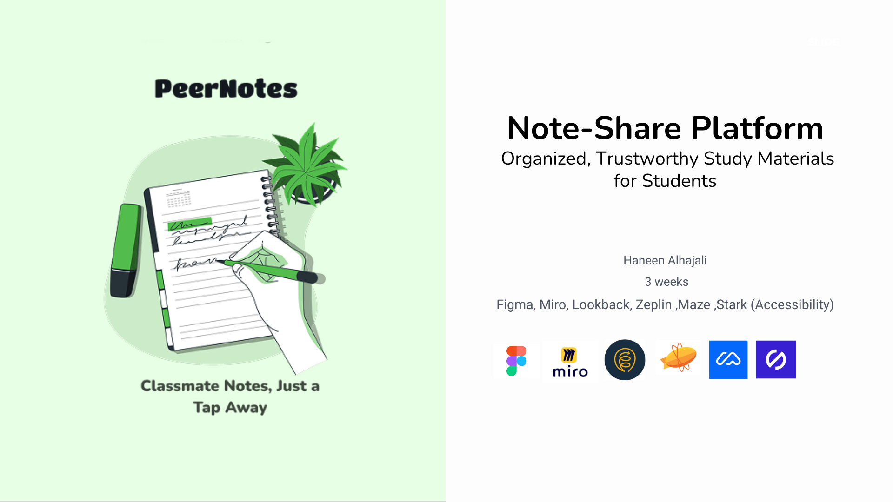
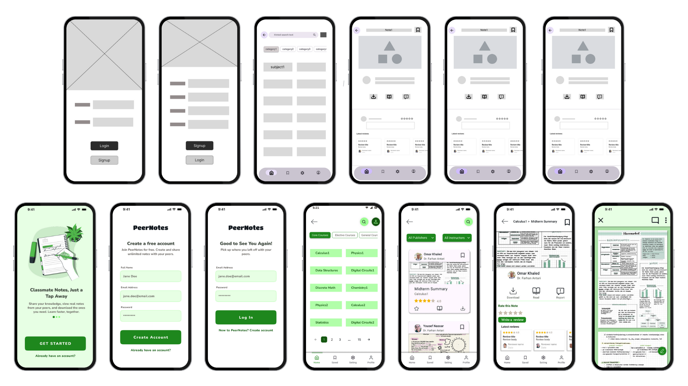

# PeerNotes - NoteShare Platform (UI/UX) 📚✨

**Organized, Trustworthy Study Materials for University Students**  
Classmate Notes, Just a Tap Away.

<table>
  <tr>
    <td></td>
    <td></td>
  </tr>
</table>

---

## Project Overview 📝

PeerNotes is a **centralized platform** for sharing study materials, designed specifically for **Computer Engineering students**.  
It solves the problem of scattered and unreliable notes across multiple platforms by providing **verified, organized, and easily accessible notes**.

**Problem:** ❌  
Students struggle to find trustworthy notes due to scattered resources on WhatsApp, Google Drive, and social media.  
60% reported difficulty finding reliable materials.  

**Solution:** ✅  
PeerNotes offers a **user-centric platform** with:  
- Centralized organization  
- Quality indicators (ratings, verified contributors)  
- Gamification & accessibility features  
to improve student study efficiency.  

---

## Key Features ✨

- 📚 Centralized subject browsing with smart categorization  
- ⭐ Quality indicators (ratings, verified contributors)  
- 👥 Community-driven features & recognition system  
- 🏆 Gamification elements for high-quality contributions  
- ♿ Accessible design compliant with **WCAG AA** standards  

---

## Research & Insights 🔍

**Methods:**

- 🗣 5 semi-structured interviews (30 min each)  
- 📊 Survey with 50+ responses  
- 🔎 Competitive analysis (WhatsApp, Google Drive, Masaaq.net)

**Key Findings:**

- Notes are scattered across 3-5 platforms per student  
- 70% need quality indicators to trust shared content  
- Students fear judgment when sharing their notes  
- Gamification motivates contributions  

---

## Design & Prototyping ✏️🎨

- Concept sketches & multiple layout explorations  
- Hand-drawn user flows & information architecture  
- Iterative improvements based on usability testing  

**Tools Used:** Figma, Miro, Zeplin, Maze, Lookback, Stark (Accessibility)

### 🔗 Lo-Fi & Hi-Fi Prototypes

| Prototype Type | Link |
|----------------|------|
| 🎨 Lo-Fi Prototype | [Open in Figma](https://www.figma.com/proto/UMHCjVWAFGI4qkdFzSendA/Note-Sharing-platform?node-id=126-11071&p=f&t=oitmhf9wgdZNlqeZ-1&scaling=scale-down&content-scaling=fixed&page-id=126%3A10209&starting-point-node-id=126%3A11071) |
| 🖼 Hi-Fi Prototype | [Open in Figma](https://www.figma.com/proto/UMHCjVWAFGI4qkdFzSendA/Note-Sharing-platform?node-id=118-6645&p=f&t=RRBv4s0IX0lWQScB-1&scaling=scale-down&content-scaling=fixed&page-id=118%3A6641&starting-point-node-id=118%3A6645) |

---

## Usability Testing & Iteration ✅

**Test Setup:**

- 10 participants via remote testing  
- Task: Locate and open a "Midterm Summary" note  
- Duration: 15–20 minutes per session  

**Findings:**

- Initial task success rate: 30% ❌  
- Pain points: small note cards, unclear action icons, navigation confusion  

**Improvements:**

- Grid layout → Single-column list 📝  
- Card size: 24px → 44px touch target ✋  
- Action icons → Icons with text labels ("Read", "Download")  
- Enhanced color contrast, font size, semantic labels 🎨  

**Result:** Task success rate improved from **30% → 80%** ✅  

---

## Impact & Results 📈

- **Task Success Rate:** 30% → 80% (+167%)  
- **Time on Task:** 4–5 min → 1–2 min ⏱  
- **User Satisfaction:** "I can now find trustworthy notes in half the time" 💯  

---

## Portfolio & Case Study 📂

For **more details** about my UX portfolio and the full case study:  
📄 [PeerNotes UX Portfolio & Case Study](P5%20Project%20UX%20Portfolio%20Case%20Study/portfolio.pptx.pdf)

---

## Next Steps 🚀

- Implement **note request feature** for missing content  
- Expand platform to additional university departments  
- Integrate with existing university systems

